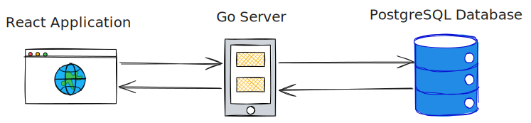

# Architecture

- [Overview](#overview)
- [Event processing](#event-processing)

## Overview

The PBB-MMO-RTS Game (Persistent Browser Based Massive Multiplayer Online Real Time Strategy Game) architecture can be boiled down to the following diagram:

## Event processing

The event processing is a tick-based approach, where the game clock runs with a pre-determined budget for the computation of event results until the next tick.

_TODO: work in progress_

## Back-end

We can divide the back-end in:

- "Root" server: starts all services, database migration, database connections, and runs the HTTP server.
- User service: the "real" world user interaction, responsible for authentication and security.
- Game service: the "virtual" world, that will have _Players_ associated with real world users, each with their _Cities_ spread accross a _World_.

Regardless of service we follow some basic structuring principles:

1. Each top level object (e.g., _City_, or _User_) has its own file (e.g., `city.go`, or `user.go`)
2. Services split the database layer into a `database.go`, interfaced with simple queries such that we can easily abstract it for unit tests
3. Endpoints should be structured uniformely by always following the steps:
   1. Read the endpoint request
   1. Validate the request for correctness / user errors
   1. (if applies) Validate authorizations to do the request
   1. Process the request: this includes computations and any necessary database call
   1. Generate a response and write it back to the caller
4. Registration of the endpoints is done at the root service

## Front-end

_TODO: work in progress_
