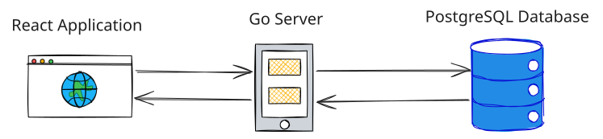

# Architecture

- [Overview](#overview)
- [Event processing](#event-processing)

## Overview

The PBB-MMO-RTS Game (Persistent Browser Based Massive Multiplayer Online Real Time Strategy Game) architecture can be boiled down to the following diagram:

## Event processing

The event processing is a tick-based approach, where the game clock runs with a pre-determined budget for the computation of event results until the next tick.

### The game event queue

State-changing game actions are not applied by the HTTP handler that receives them. Instead:

1. The HTTP handler does light, non-binding validation (request shape, authentication, basic ownership), then **enqueues an event** in the `game_event` table and returns `202 Accepted`. It never writes game objects directly.
2. A single background **game loop** (`GameService.Run`, started once at the root server) ticks at a fixed cadence. On each tick it drains every event that is **due** and applies them.
3. The game loop is the **sole writer** of game objects (e.g. `movement` rows, and in the future `city` updates). Because all writes go through one ordered processor, game rules are evaluated deterministically.

Events are stored with:

- `process_after` (TIMESTAMPTZ) — the event becomes due once `now() >= process_after`. Player commands use `now()` (processed next tick); future scheduled effects (e.g. a movement arrival) will use their target time.
- `seq` (BIGSERIAL) — a monotonic, database-assigned sequence used to break ties.
- `key` (UNIQUE) — an idempotency key; duplicate enqueues are ignored.

The loop reads due events ordered by `(process_after, seq)`, giving a deterministic total order. Effects are written with idempotent statements (`ON CONFLICT DO NOTHING` on create, no-op delete on cancel) and an event is only marked processed once its effect has been applied — so a transient failure simply replays the same tick without double-applying.

Currently the **create movement** and **cancel movement** actions flow through the queue. Resource/troop deduction, arrival effects, and combat resolution are not yet implemented.

> Boundary: `FoundCity` and `JoinWorld` still write the `city` table synchronously from their handlers (they have their own settle lock). Routing those through the queue too — for full cross-feature determinism — is future work.

## Back-end

We can divide the back-end in:

- "Root" server: starts all services, database migration, database connections, and runs the HTTP server.
- User service: the "real" world user interaction, responsible for authentication and security.
- Game service: the "virtual" world, that will have _Players_ associated with real world users, each with their _Cities_ spread accross a _World_.

Regardless of service we follow some basic structuring principles:

1. **There is only one event queue per Game world - don't create your own async processing unless there is a very good reason for it**
1. Each top level object (e.g., _City_, or _User_) has its own file (e.g., `city.go`, or `user.go`)
1. Services split the database layer into a `database.go`, interfaced with simple queries such that we can easily abstract it for unit tests
1. Endpoints should be structured uniformely by always following the steps:
   1. (if applicable) Read the endpoint request
   1. (if applicable) Validate the request for correctness / user errors
   1. (if applicable) Validate authorizations to do the request
   1. Process the request: this includes computations, any necessary database call, or only submission of events
   1. Generate a response and write it back to the caller (even if it is 202 or 204)
1. Registration of the endpoints is done at the root service
1. Database migrations are defined and run from `server/migrations/`, they should include any SQL for creation of tables, indexes, procedures, etc.

## Front-end

_TODO: work in progress_
